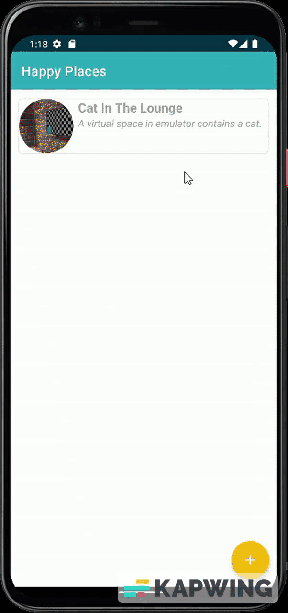

# Android-PlacesApp
The purpose of the app is to store information about happy/favorite/memorable places a person has visited or travelled to.
Details such as name of the place, a short description of the place, date visited, location and a picture are needed. 
The animation below shows how to add a place.

  

The current date is chosen by default. For the location, user can either use google map search (**a valid google maps api key is needed in order for it to work)
or allow access to current location by clicking the location icon on the right. This will add the current location in the box. 
Location provider settings need to be turned on for both cases first. 

The picture can be chosen from gallery or a live photo can be clicked using the camera app (access permission required for both). 
After selecting the picture, it can be further editted like cropping, filtering, etc. An option for delete is available if it is to be changed. 

## View, Edit and Delete
These are the three operations that can be carried out other than adding a place. The animations for all of them are shown below. 

  View|Edit|Delete
  :----:|:----:|:----:
  &nbsp; &nbsp; &nbsp;  &nbsp; &nbsp; &nbsp; | &nbsp; &nbsp; &nbsp;  &nbsp; &nbsp; &nbsp; |  &nbsp; &nbsp; &nbsp; 

Viewing the place is simple. However, to see the place location on google maps, you need access and **valid maps api key**.
Next, a place details can be editted by swiping it to the right. In the middle animation above, as an example, the date and picture of the place are changed.
Remember to press the update for the changes to happen. These changes can be seen once the place is viewed again. 
Finally, the place can be deleted by swiping it to the left. 
